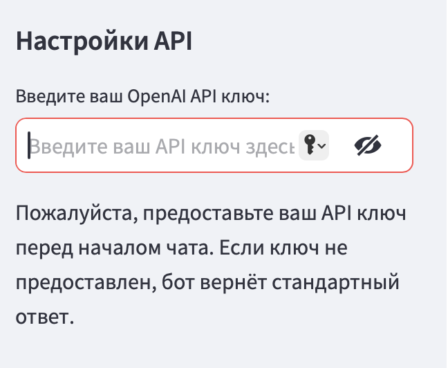
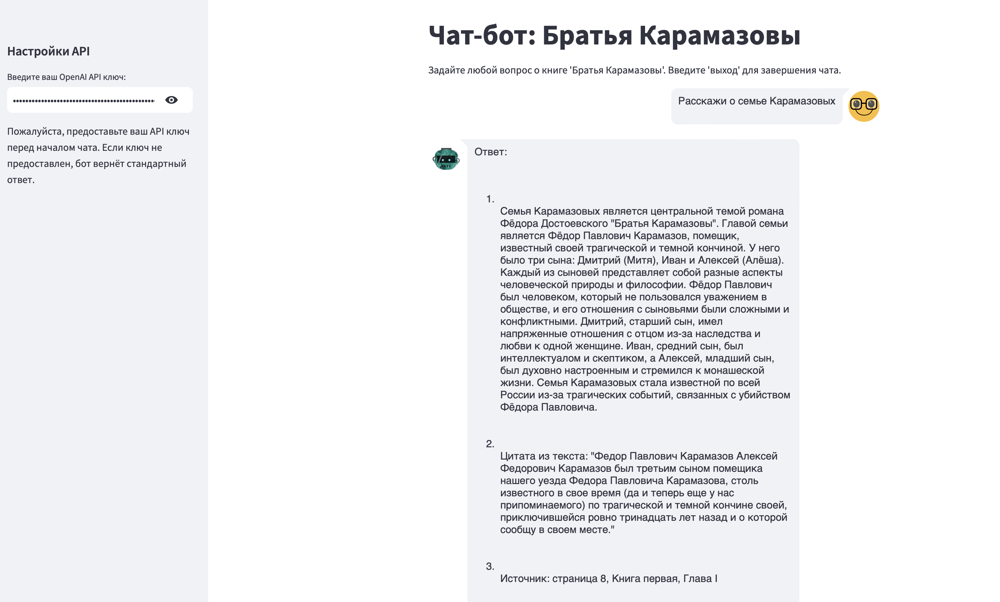
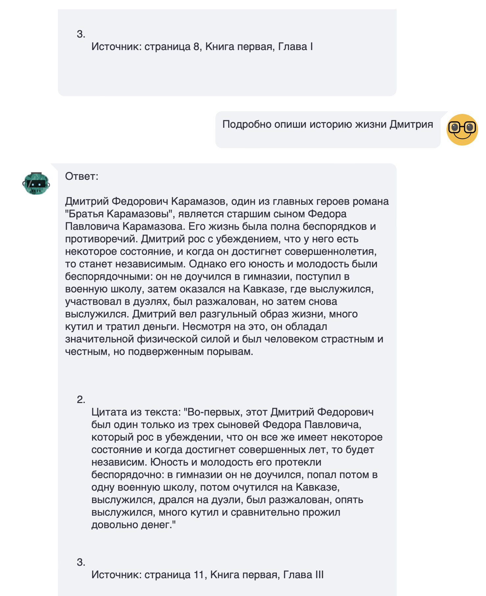
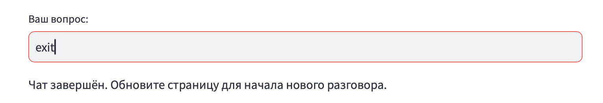

# Проект BookRAG

Команда "Bookworms"

Участники: Леднева Дарья, Федотова Евгения, Клименченко Дмитрий

## Описание проекта

Чат-бот для ответов на вопросы по книге Федора Михайловича Достоевского "Братья Карамазовы". Пользователь
задает вопросы по сюжету/персонажам книги, ассистент предоставляет ответ на основе базы знаний по книге, с указанием
глав/частей книги, на основе которых был сформирован ответ.

### Использованные технологии

FAISS, LangChain, Streamlit

### Конечный результат

Развернуто локальное решение с frontend'ом, реализованным с помощью технологии Streamlit.

## Запуск приложения

### OpenAI API key

Для генерации ответов на вопросы наше решение использует модель от OpenAI, поэтому для использования чат-бота требуется
иметь собственный OpenAI API ключ, который может быть сгенерирован и оплачен
здесь: https://platform.openai.com/docs/overview

### Установка зависимостей

`pip install streamlit streamlit-chat`

`pip install langchain`

`pip install -U langchain-community`

`pip install sentence-transformers`

`pip install faiss-gpu`

`pip install openai`

`pip install langchain_openai`

`pip install pypdf`

`pip install tiktoken`

### Запуск и setup

Для запуска приложения воспользуйтесь командой:

`streamlit run rag-solution-with-streamlit.py
`

Steamlit-приложение автоматически развернется в вашем браузере на localhost.

Введите ваш OpenAI API ключ в соответствующее поле в интерфейсе веб-приложения:

После ввода корректного ключа будет произведена индексация книги и построена векторная база, необходимая для работы RAG.
После этого можно пользоваться чат-ботом и задавать интересующие вопросы.

## Работа приложения

В соответствующем поле введите ваш вопрос по книге Ф.М. Достоевского "Братья Карамазовы". Чатбот вернет ответ, состоящий
из 3-х частей:

1. Непосредственно ответ на поставленный вопрос
2. Цитата из текста книги
3. Указание места книги, откуда взята цитата

Наше приложение позволяет задавать неограниченное количество вопросов, поддерживая с ботом длительный диалог.

Для завершения диалога с чат-ботом введите "exit"/"выход"/"quit".

